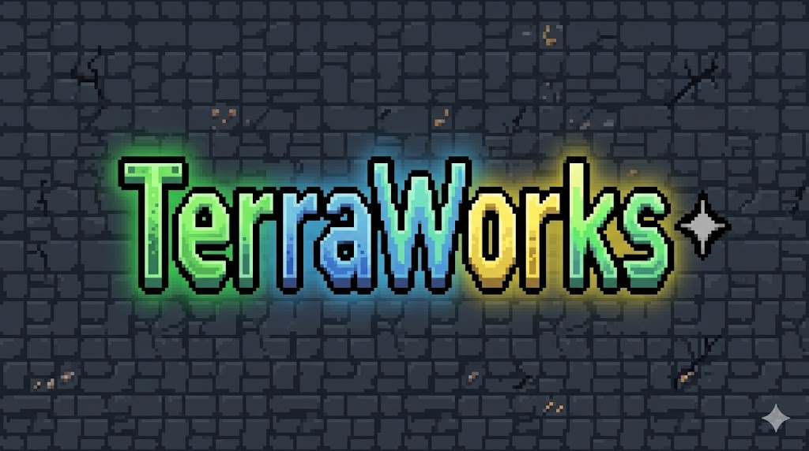
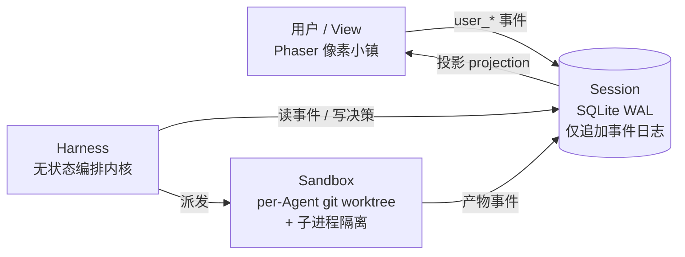
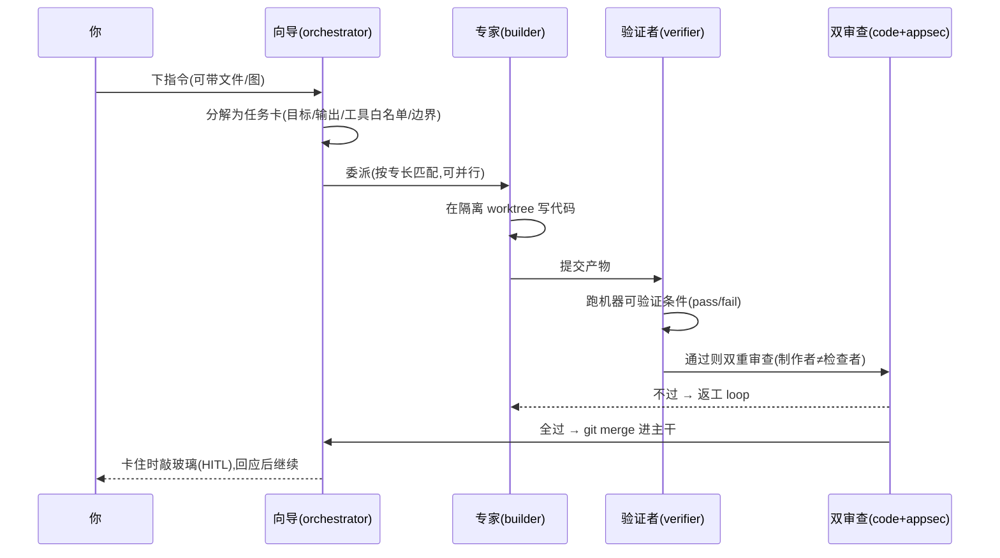

<div align="center">



### 游戏化多 Agent 软件开发编排平台

**一队 AI 专家在一座像素小镇里协作写代码——你跟"向导"对话即下任务、点 NPC 即干预、一屏即系统全量健康状态。**

*A gamified multi-agent orchestration platform where a team of AI specialists collaborates to build software — rendered as an interactive pixel town.*

</div>

---

## 这是什么

TerraWorks 把"多个 AI Agent 协作完成开发任务"的全过程,渲染成一座**可交互的像素小镇**:向导(orchestrator)在大堂分派任务,专家 NPC 在工坊/验证间/审查间各司其职,产物经验证与双重审查后合并交付。

与同类产品(Pixel Agents / AgentRoom 等)的**本质区别在于双向编排闭环**——界面不是 trace→动画的单向被动镜子,而是**动画 ⇄ 编排内核的操作回路**:你能在 Agent 卡住时"敲玻璃"介入、能下指令真正驱动编排。游戏化是信息密度手段,不是装饰。

> 它在"大、可拆、需可信产出"的任务上才显价值:**并行 + 真验证 + 制作者≠检查者审查 + 崩溃续作 + 人在回路干预**——这些是单次对话给不了的"产出可信"保证。

## ✨ 核心特性

- 🧠 **多 Agent 协作流水线**:向导分解 → 专家并行执行 → 机器验证 → 代码审查 + 安全审查 → git merge 仲裁
- 🔁 **验证-返工 loop**:验证条件必须机器可判定(command + expected exit_code),不过则返工,杜绝"看起来能用"
- 🛡 **制作者≠检查者(maker-checker)**:审查 Agent 的上下文代码级硬过滤掉"叙述",只看代码/diff/测试结果
- 🧩 **角色即插件**:Agent = `roles/*.md`,双轴模型(功能角色 × 专长),同角色可多实例并行
- 🪟 **人在回路(HITL)双向干预**:Agent 卡住"敲玻璃" → 你在界面回应(整改/放弃)→ 经事件回流编排内核
- 💾 **事件溯源 + 崩溃续作**:仅追加事件日志为唯一事实源,进程强杀后从日志 `wake()` 续作("恢复状态,不恢复思维")
- 🔌 **可插拔多 LLM 供应商**:cc-switch 式预设 + 一键热切换(DeepSeek / GPT / Claude / Gemini,OpenAI 兼容端点)
- 🗂 **在你的真实仓库上干活**:指向任意 git 项目,分支→验证→双审→merge 主干,全程可 diff 可回滚
- 🖥 **桌面应用**:Tauri 2.0 壳 + Python 后端打包为 sidecar 自启,双击即用、零终端依赖

## 🏛 架构

三层 + View,CQRS 单向数据流(View 只读 Session,玩家交互一律转 `user_*` 事件交 Harness 消费)。



| 层 | 职责 | 关键设计 |
|---|---|---|
| **Session** | 事实源 | SQLite(WAL)**仅追加**事件日志,15 类领域事件;状态由**投影**重建,禁 UPDATE/DELETE |
| **Harness** | 编排内核 | **纯函数、无状态**;决策先落日志后生效(write-ahead);`wake(sessionId)` 崩溃续作 |
| **Sandbox** | 执行隔离 | 每 Agent 独立 **git worktree + 子进程**;产物只走 git merge 交换;`ThreadPoolExecutor` 并行派发 |
| **View** | 可视化交互 | Phaser 小镇;**状态-动画投影协议** Python↔TS 双端一致性锁(parity) |

## 🔄 一次任务的生命周期



## 🧱 技术栈

**后端**:Python 3.11 · FastAPI · SQLite(WAL)· litellm(可插拔 LLM)· WebSocket(catch-up + live 两阶段订阅)· git worktree · 子进程隔离
**前端**:React 18 · TypeScript · Vite · Phaser 3
**桌面**:Tauri 2.0(Rust)· PyInstaller(后端 sidecar)
**工程**:契约先行(事件 / 任务卡 / 验证条件 三套 JSON-Schema)· ADR 决策记录(24+ 条)

## 🚀 运行

**开发模式**(两个终端):
```bash
# 1) 后端(实时模式;在设置面板填 key,或把 *_API_KEY 放 .env)
TERRA_LLM_MODE=real python -m harness.view.serve --port 8000
# 2) 前端
npm install && npm run dev      # 打开 http://localhost:5173
```

**桌面打包**(产出 .msi/.exe,后端随 app 自启):见 [docs/BUILD-desktop.md](docs/BUILD-desktop.md)。

**离线测试**:
```bash
python -m pytest harness/tests/ -q   # Harness 端到端(mock LLM,确定性)
npm run test                         # 前端投影 parity
```

## 🗺 里程碑

- **M1–M2** 无头 Harness:事件日志 + 分解委派 + test-first 多卡 + 多实例执行 + 验证三层 + 审查 + 返工 + 仲裁 merge + 崩溃续作
- **M2.5–M2.7** 真并行(独立 worktree + 子进程)+ 角色感知专家委派 + 双重审查(代码 + 安全)
- **M3** 像素小镇 View:状态-动画协议 + catch-up/live 订阅 + 悬停看 think + 任务板
- **M4** 双向交互:写端点 + 编排宿主 + HITL,"全程不开终端完成一次开发"
- **M5** 打磨发布:帧动画 + 瓦片场景 + 深色 UI + 实时动态流 + 多供应商热切换 + 真实仓库工作区 + 文件/预览 + **Tauri 桌面打包(后端 sidecar 自启)**

## 📐 设计基线与决策

- 设计基线:[ARCHITECTURE.md](ARCHITECTURE.md)(冻结,偏离须先提 ADR)
- 工程速查与红线:[PROJECT.md](PROJECT.md)
- 决策记录:[`docs/adr/`](docs/adr/)(事件 schema、真隔离、并行派发、状态-动画投影、双向交互、沙箱隔离、目标工作区…)
- 契约 schema:[`docs/contracts/`](docs/contracts/)

---

<div align="center">
<sub>个人全栈项目 · 用 Claude Code 协作开发</sub>
</div>
